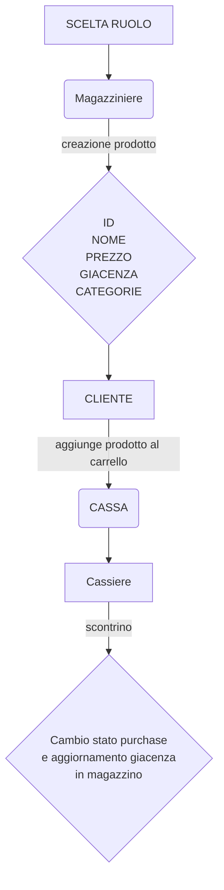

# SUPERMERCATO ADVANCED

Implementare le entità che compongono un supermercato.

> Partendo dalla soluzione dell'esercizio `27_Classi8parte` implementare le seguenti entità:
- **Dipendente**:
Avrà i campi (ID,nome,cognome) ed un campo`ruolo` di tipo `String` che rappresenta ill ruolo del dipendente (es. "cassiere","magazziniere")
Implementare i metodi `getRuolo` e `setRuolo`.


- Magazziniere: può aggiungere o rimuovere prodotti dal magazzino

- Amministratore: rappresenta un amministratore del supermercato. Un amministratore è un dipendente con ruolo "amministratore".
  Può impostare il ruolo dei dipendenti. Implementare il metodo setRuolo che accetta come parametri un dipendente e una stringa
  rappresentante il ruolo da assegnare al dipendente.

| Dipendente | Tipi di dato | Note |
| --- | --- | --- |
| ID | int | viene generato in automatico con un progressivo |
|cognome | String | viene assegnato dall' admin |
|ruolo | String| viene assegnato dall' admin e può essere magazziniere o cassiere |

| Cliente | Tipo di dato | Note |
| --- | --- | --- | 
| ID | int | viene generato in automatico con un progressivo |
| username | string |  ognuno decide come vuole farlo |
| carrello | prodotto[] | |
| storico acquisti | purchases[] | |
| percentuale sconto | int | viene incrementata a seconda del valore dello storico degli acquisti |
| credito | double | viene utilizzato per fare gli acquisti |

| Prodotto | Tipo di dato | Note |
| ---  | --- | --- |
| ID | int | viene generato in automatico con un progressivo |
| nome | string | viene inserito dal magazziniere |
| prezzo | double | viene inserito dal magazziniere |
| quantità | int | viene inserito dal magazziniere |
 | --- | --- |
 | categoria | ID |

Purchases è lo stato nel quale si trova l'acquisto di un cliente. Prima di essere passato in cassa.

 - Quando viene passato allo stato `completato` la cassa può processare lo scontrino.

 | Purchases | Tipo di dato | Note |
 | --- | --- |--- |
 | ID | int | viene generato in automatico con un progressivo |
| cliente | cliente | |
| prodotti | prodotto[] | viene inserito dal cliente |
| quantita | int | viene inserito dal cliente |
| data | Date | viene generato in automatico con la data corrente (quando il cliente completa l'acquisto) |
| stato | Bool | lo stato di un acquisto di default e `in corso` e può essere modificato dal cliente in `completato` o `annullato` |

| Cassa | Tipo di dato | Note |
| --- | --- | --- |
| ID | int | viene generato in automatico con un progressivo |
| dipendente | Dipendente | |
| acquisti | purchases[] | |
| scontrino processato | bool | di default è `false` e diventa `true` quando la cassa ha processato lo scontrino|


- Ruoli:


| **Cassiere** | **Magazziniere** | **Amministratore** | **Cliente** |
| --- | --- | --- | --- |
| Può registrare i prodotti acquistati da un cliente che ha degli acquisti in stato completato e calcolare il totale da pagare generando lo scontrino | Può visualizzare, aggiungere o rimuovere prodotti dal magazzino, può gestire le categorie |  Può impostare il ruolo dei dipendenti. | Può aggiungere o rimuovere prodotti e cambiare lo stato dell'ordine.

# Diagramma prodotto
- Dall'inserimento del prodotto in magazzino, alla fine dell' acquisto.


# Documentazione
### Ho creato la cartella 'Models' in cui ho inserito i modelli .cs:
- Cassa.cs
- Categoria.cs
- Cliente.cs
- Dipendente.cs
- Prodotto.cs
- Purchase.cs

### Ho creato la cartella Repositories in cui ho inserito i repositories:
- CarrelloRepository.cs
- ClienteRepository.cs
- DipendenteRepository.cs
- ProdottoRepository.cs

### Ho creato la cartlla Manager in cui ho inserito:
- ManagerCarrello.cs
- ManagerCliente.cs
- ManagerDipendente.cs
- ManagerProdotto.cs

>ManagerDipendente e ManagerCliente hanno quasi la stessa struttura
### Ho inserito i menu per:
- Il dipendente
- Il cliente
- Il magazziniere
- L' Amministratore
da cui ognuno può compiere operazioni specifica in base al proprio ruolo

_Nel corso del codice ho inserito un nuovo ->  namespace 'MyApp.Models'(inserito prima di ogni cosa) perchè il compilatore entrava in confusione e trovava ambiguità poichè ho usato più definizioni della classe Prodotto, in questo modo sembra essersi risolto il problema/conflitto_

### Nella cartella `'Utilities'` ho inserito nel codice `'InputManager.cs'`, la funzione `LeggiDouble`, che prima non c'era, per riuscire a convertire `cliente.Credito` che mi dava problemi in `AggiornaCliente (int id, Cliente nuovoCliente)` .
Per scrivere il codice della conversione in double, ho adattato il codice della conversione del decimale.  Quindi:

```csharp
public static double LeggiDouble(string messaggio, double min = double.MinValue, double max = double.MaxValue)
    {
        double valore; //variabile per memorizzare il valore double acquisito
        while (true)
        {
            Console.Write($"{messaggio}");
            string input = Console.ReadLine();
            if (input.Contains(","))
            {
                input = input.Replace(",", ",");

                // try parse per convertire la stringa in un double e controllare se l'input è valido
                if (double.TryParse(input, out valore) && valore >= min && valore <= max)
                {
                    return valore;
                }
                else
                {
                    Console.WriteLine($"errore: inserire un numero double compreso tra {min} e {max}");
                }
            }
        }
    }
 ```

```csharp
 public void AggiornaCliente(int id, Cliente nuovoCliente)
    {
        var cliente = TrovaCliente(id);
        if (cliente != null)
        {
            
            cliente.UserName = InputManager.LeggiStringa("Inserisci nuovo UserName: ");
            cliente.StoricoAcquisti = nuovoCliente.StoricoAcquisti;
            cliente.PercentualeSconto = nuovoCliente.PercentualeSconto;
            cliente.Credito = InputManager.LeggiDouble(" Inserisci nuovo credito: ");
        }
    }
 ```

